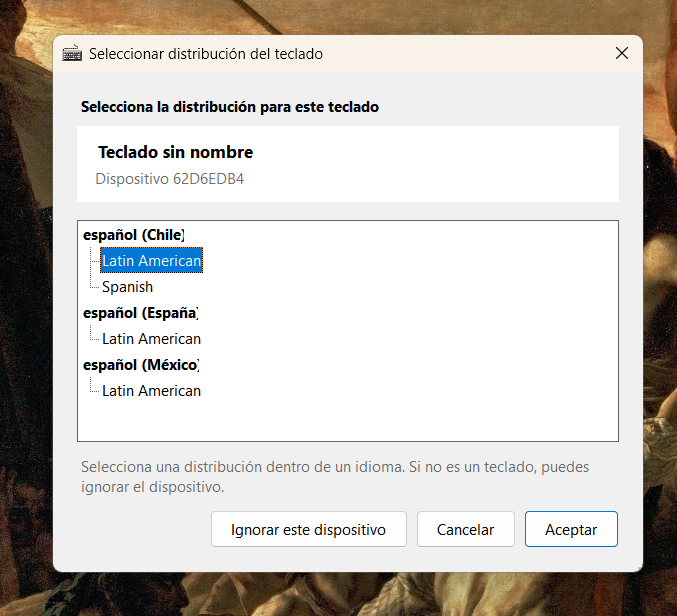
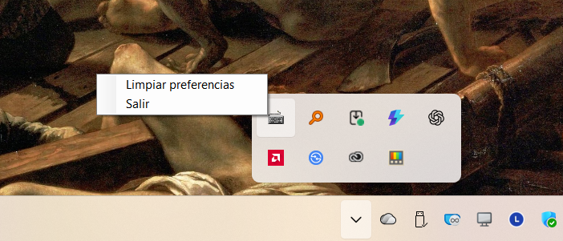

# Continuación de RightKeyboard 1.5

Fecha del registro: 29 de junio de 2026.

Este documento conserva el resultado de la primera prueba en máquina host de `1.5.0-alpha.1` y define el siguiente bloque de trabajo. No describe funciones terminadas; es la especificación para reanudar el desarrollo.

## Resultado de la prueba

La función principal sigue operativa:

- se abre el selector al pulsar un dispositivo sin preferencias;
- los idiomas aparecen como nodos y las distribuciones como hijos;
- la selección de una distribución funciona correctamente;
- el identificador técnico del dispositivo aparece en el diálogo;
- no se informaron regresiones en los errores corregidos por la versión 1.4.

Capturas de referencia:

## Problemas visuales confirmados

### Selector

El `TreeView` comunica la jerarquía, pero conserva una apariencia de control Win32 heredado:

- borde duro y contenido demasiado próximo a los extremos;
- líneas punteadas y selección rectangular anticuadas;
- distribución del espacio poco equilibrada, con una lista que se percibe cortada o encajada;
- demasiado espacio vacío cuando hay pocas distribuciones;
- botones funcionales, pero sin una jerarquía visual suficientemente clara;
- el bloque del dispositivo no permite corregir el texto **Teclado sin nombre**.

### Menú del área de notificación

`ContextMenuStrip` sigue usando una presentación clásica que contrasta con el panel de iconos de Windows 11. La traducción es correcta, pero el menú no se percibe integrado con la interfaz actual del sistema.

## Alias asignado por el usuario

El selector debe permitir asignar un nombre reconocible al dispositivo. Esta capacidad no debe limitarse a dispositivos sin nombre: un usuario puede querer distinguir dos teclados iguales.

Comportamiento propuesto:

1. Mostrar el nombre detectado por Windows cuando exista.
2. Mostrar un campo **Nombre para este teclado** con el nombre detectado como sugerencia.
3. Si Windows no entrega nombre, sugerir `Teclado <ID corto>` en vez de **Teclado sin nombre**.
4. Guardar el valor introducido como `customName` dentro de `preferences.json`.
5. Usar el alias en el selector y en la futura ventana de configuración, sin reemplazar ni ocultar el identificador técnico.
6. Conservar el alias al recuperar una preferencia mediante huella de modelo.

El alias se guardará también para dispositivos ignorados, porque ayuda a entender y corregir posteriormente esa lista.

## Ventana adicional de configuración

Se añadirá una ventana **Configuración** como flujo complementario al selector automático. El menú de la bandeja pasará a contener:

1. **Configuración**
2. **Limpiar preferencias**
3. separador
4. **Salir**

La ventana debe leer el mismo `preferences.json` y mostrar tanto dispositivos conectados como dispositivos recordados que actualmente estén desconectados.

Por cada dispositivo mostrará:

- alias asignado por el usuario;
- nombre detectado por Windows;
- identificador técnico corto;
- estado conectado o desconectado;
- distribución asociada;
- estado normal o ignorado;
- fecha de última detección, si se incorpora al esquema.

Acciones requeridas:

- cambiar el alias;
- cambiar la distribución sin limpiar todas las preferencias;
- marcar o desmarcar como ignorado;
- olvidar un dispositivo individual;
- guardar o cancelar los cambios.

**Limpiar preferencias** seguirá siendo el borrado global. La ventana de configuración proporcionará las operaciones selectivas.

## Dirección visual

Se mantendrá WinForms y el bajo consumo del proceso. La siguiente iteración debe priorizar controles compuestos y un diseño propio liviano antes de incorporar Windows App SDK.

Para el selector:

- reemplazar el `TreeView` clásico por grupos de idioma en un panel desplazable;
- representar cada distribución como una fila seleccionable de ancho completo;
- usar espaciado uniforme, estados hover/focus y una selección menos agresiva;
- ajustar la altura al contenido dentro de límites mínimo y máximo;
- mantener navegación por teclado, lector de pantalla y escalado por DPI;
- separar visualmente las acciones **Ignorar**, **Cancelar** y **Aceptar**.

Para el menú de bandeja se evaluará, en este orden:

1. un renderer propio y liviano para `ContextMenuStrip`;
2. si el resultado continúa pareciendo heredado, un pequeño flyout WinForms sin borde, con esquinas y colores del sistema;
3. Windows App SDK solo si ofrece una mejora material que justifique su tamaño y costo de mantenimiento.

## Evolución del archivo de preferencias

El siguiente esquema deberá agregar como mínimo:

- `customName`;
- `detectedName` conservado para diagnóstico;
- opcionalmente `lastSeenUtc`;
- capacidad de editar una preferencia sin recrearla.

La migración desde el esquema actual de 1.5 debe ser automática y conservar asociaciones e ignorados.

## Orden recomendado para reanudar

1. Ampliar el esquema de preferencias y sus pruebas con alias y metadatos editables.
2. Crear el modelo y la ventana **Configuración**.
3. Conectar la nueva opción al menú de bandeja.
4. Reemplazar el `TreeView` por el selector visual moderno y responsivo.
5. Aplicar el alias tanto al selector como a la configuración.
6. Evaluar y modernizar el flyout de bandeja.
7. Probar con teclado sin nombre, dos teclados iguales, un dispositivo ignorado y un periférico compuesto como MX Master 3S.

## Estado al pausar

- Rama: `codex/version-1.5`.
- Último commit funcional: `9fb0eb3`.
- Versión: `1.5.0-alpha.1`.
- Pruebas: 23 correctas.
- La aplicación fue validada en una máquina host.
- Esta especificación y las capturas quedan incorporadas como punto de reanudación versionado.
